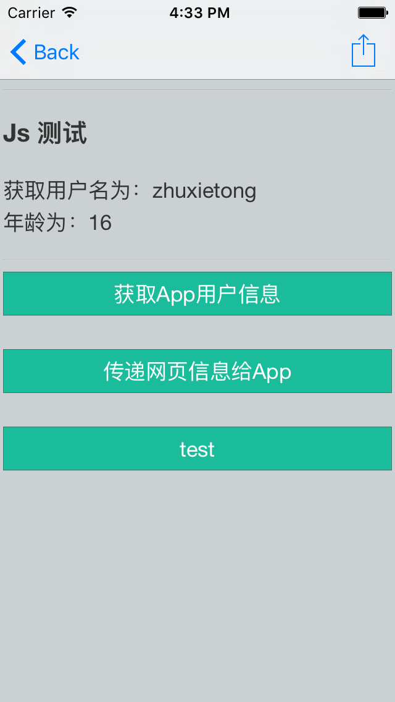

# JoWebJS
# JoWebViewConfiguration

针对 iOS8 WKWebView的javascript 的交互使用做了基本封装

# Usage使用

# 使用

主要是两个block属性

- config_block  //webView创建时，提供注入js代码 和添加app 对Js的观察处理

- hander_block   // Js执行某观察方法时会调用

参照demo

# Supplement

- if you have any question or idea about this control, send email to me 'zhuxietong@me.com'.
